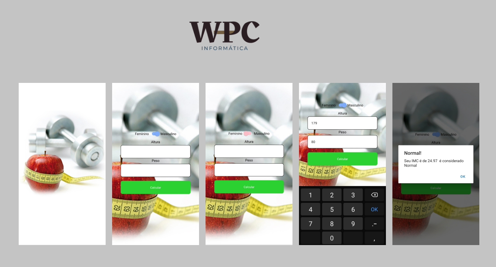

# Indice

- [Sobre](#-sobre)
- [Tecnologias](#Tecnologias)
- [Como baixar o projeto](#-como-baixar-o-projeto)

## 🔖&nbsp; Sobre

Projeto desenvolvido para calcular o IMC

---

## Tecnologias

Esse projeto foi desenvolvido com as seguintes tecnologias:

- [React Native](https://facebook.github.io/react-native/)
- [Expo](https://expo.io/)

## Como baixar o projeto

[Clique aqui](.github/imc-app.apk)

---

<h3 align="center" >Vamos nos conectar 😉</h3>

  &ensp;
  &ensp;
  

 

    Desenvolvido 💜 por William Pereira da Conceição

